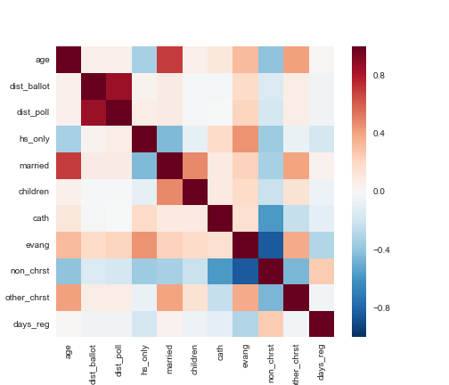
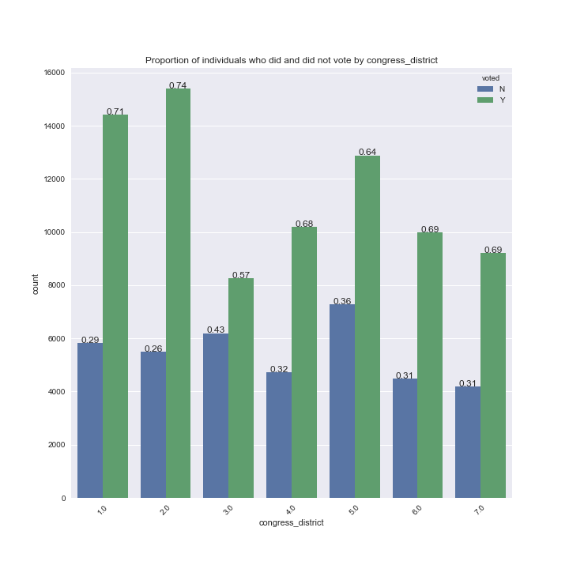
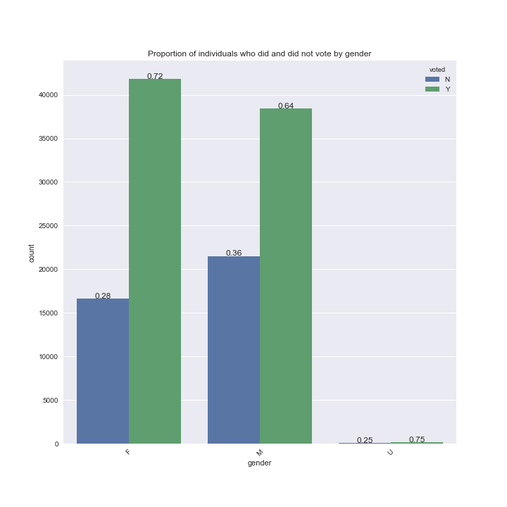
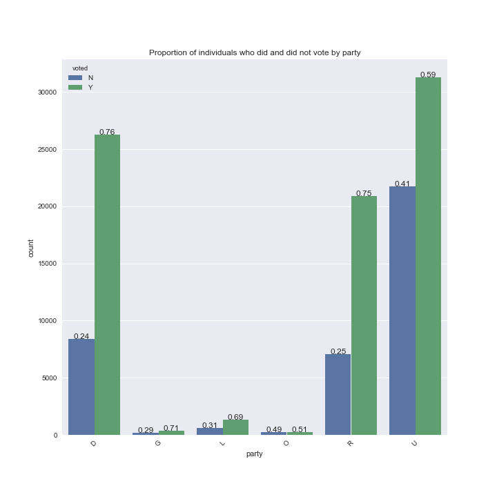
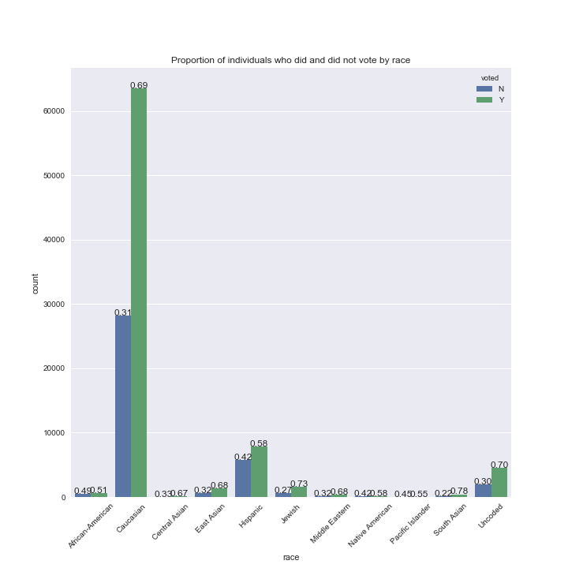
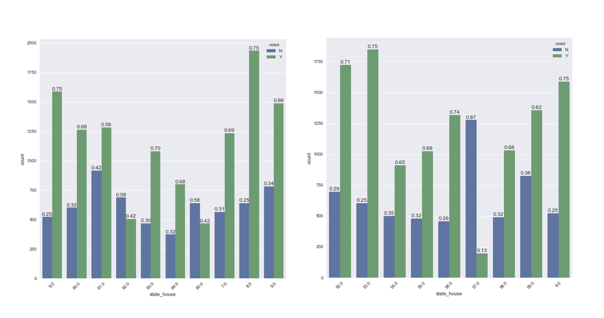

# Predict which voter-eligible Colorado citizens actually voted in the 2016 US presidential election.

This is the Spring 2017, Harvard Statistics 149: Generalized Linear Models prediction contest/course project.

The goal of this project is to use the modeling methods in Statistics 149 (and possibly other related methods) to analyze a data set on whether a Colorado voting-eligible citizen ended up actually voting in the 2016 US election. These data were kindly provided by [moveon.org](https://front.moveon.org/). The competition can be found [here](inclass.kaggle.com/c/who-voted) and ended April 30, 2017, at 10pm EDT.

Below we list the predictor variables and our findings regarding each from the [initial exploration](who-voted_EDA.ipynb) of the data:

1. **voted:** This is the (binary) response variable and denotes whether an individual did (Y) or did not (N) vote. ~67.8% of individuals did vote (80,357) compared to ~32.2% who did not vote (38,172). This class imbalance is important to keep in mind for model fitting, as certain models do not handle imbalanced classes well.
2. **gender:** Gender is coded as a 3 level factor (female, male, unknown). Females (58,414) and males (59,916) are equally represented in the dataset, and only 199 are unknown.
3. **congress_district:** Congressional district the voter is registered in; this is a 7 level factor with 2 missing values. These missing values are not a concern as they represent an insignificant portion of the data.
4. **state_house:** State house district the voter is registered in; a 65 level factor with 2 missing values. The large number of levels may make incorporation of this predictor difficult if using a dummy coding schema.
5. **age:** Age in years of the voter; no missing or bizarre values
6. **dist_ballot:** Distance from closest ballot drop-off location in miles. 113,247 values are missing, or ~95.5% of the data. This is significant and was addressed via imputation in [this](who-voted_impute.ipynb) notebook. Note that in the final model imputation actually led to worse performance than simply dropping these variables, likely due to the large percentage of data that needed to be imputed.
7. **dist_poll:** Distance in miles to voter's polling place; same missing values as dist_ballot
8. **party:** D=Democrat, R=Republican, L=Libertarian, G=Green, O=American Constitutional Party, U=Unaffiliated
9. **race:** 11 level factor, including Uncoded. 
10. **hs_only:** Score for likelihood of having high school as highest completed degree
11. **married:** Score for likelihood of being married
12. **children:** Score for likelihood of having children at home
13. **cath:** Score for likelihood of being Catholic
14. **evang:** Score for likelihood of being Evangelical
15. **non_chrst:** Score for likelihood of being non-Christian
16. **other_chrst:** Score for likelihood of being another form of Christian
   * likelihood scores were all caculated from proprietary models
17. **days_reg:** Number of days since the individual registered as a voter; no missing or bizarre values

Below are the summary statistics for our quantitative variables grouped by whether the citizen voted (Y) or did not vote (N):

voted_Y  |  age      |  dist_ballot  |  dist_poll  |  hs_only  |  married  |  children  |  cath     |  evang    |  non_chrst  |  other_chrst  |  days_reg
---------|-----------|---------------|-------------|-----------|-----------|------------|-----------|-----------|-------------|---------------|----------
count    |  80357.0  |  3897.0       |  3897.0     |  80357.0  |  80357.0  |  80357.0   |  80357.0  |  80357.0  |  80357.0    |  80357.0      |  80357.0
mean     |  37.0     |  3.0          |  3.0        |  22.0     |  48.0     |  34.0      |  12.0     |  16.0     |  40.0       |  31.0         |  453.0
std      |  16.0     |  2.0          |  2.0        |  15.0     |  33.0     |  22.0      |  6.0      |  7.0      |  11.0       |  4.0          |  108.0
min      |  18.0     |  2.0          |  2.0        |  4.0      |  3.0      |  1.0       |  5.0      |  2.0      |  5.0        |  9.0          |  223.0
25%      |  24.0     |  2.0          |  2.0        |  10.0     |  16.0     |  16.0      |  9.0      |  10.0     |  32.0       |  29.0         |  371.0
50%      |  32.0     |  2.0          |  2.0        |  17.0     |  46.0     |  28.0      |  12.0     |  15.0     |  39.0       |  31.0         |  441.0
75%      |  47.0     |  3.0          |  3.0        |  30.0     |  76.0     |  49.0      |  15.0     |  21.0     |  48.0       |  34.0         |  536.0
max      |  101.0    |  29.0         |  29.0       |  84.0     |  100.0    |  90.0      |  74.0     |  56.0     |  74.0       |  51.0         |  677.0

voted_N  |  age      |  dist_ballot  |  dist_poll  |  hs_only  |  married  |  children  |  cath     |  evang    |  non_chrst  |  other_chrst  |  days_reg
---------|-----------|---------------|-------------|-----------|-----------|------------|-----------|-----------|-------------|---------------|----------
count    |  38172.0  |  1385.0       |  1385.0     |  38172.0  |  38172.0  |  38172.0   |  38172.0  |  38172.0  |  38172.0    |  38172.0      |  38172.0
mean     |  33.0     |  3.0          |  3.0        |  25.0     |  36.0     |  32.0      |  12.0     |  16.0     |  41.0       |  31.0         |  472.0
std      |  14.0     |  2.0          |  3.0        |  15.0     |  28.0     |  18.0      |  7.0      |  6.0      |  10.0       |  4.0          |  111.0
min      |  18.0     |  2.0          |  2.0        |  4.0      |  3.0      |  1.0       |  5.0      |  2.0      |  5.0        |  10.0         |  223.0
25%      |  22.0     |  2.0          |  2.0        |  13.0     |  13.0     |  18.0      |  8.0      |  11.0     |  34.0       |  29.0         |  383.0
50%      |  28.0     |  2.0          |  2.0        |  22.0     |  24.0     |  27.0      |  11.0     |  15.0     |  41.0       |  31.0         |  466.0
75%      |  39.0     |  3.0          |  3.0        |  35.0     |  59.0     |  44.0      |  14.0     |  20.0     |  48.0       |  33.0         |  567.0
max      |  99.0     |  46.0         |  46.0       |  84.0     |  100.0    |  89.0      |  73.0     |  50.0     |  73.0       |  47.0         |  677.0

On average, people who voted may be slightly older and have a higher likelihood of being married than those who did not vote (although the standard deviations are large). As mean values can be skewed by extreme values, below we also display the median values:

voted  |  age  |  dist_ballot  |  dist_poll  |  hs_only  |  married  |  children  |  cath  |  evang  |  non_chrst  |  other_chrst  |  days_reg
-------|-------|---------------|-------------|-----------|-----------|------------|--------|---------|-------------|---------------|----------
N      |  28   |  2.26         |  2.42       |  21.7     |  23.7     |  27.4      |  11.0  |  15.3   |  40.8       |  31.0         |  466
Y      |  32   |  2.28         |  2.45       |  17.3     |  46.0     |  27.5      |  12.0  |  15.0   |  39.2       |  31.4         |  441

Age and hs_only also differ the most in terms of the median, further suggesting these may be important predictors. Next we can look at the correlations between our variables:

The correlation matrix shows expected correlations, e.g., dist_poll and dist_ballot are highly correlated, as are age and likelihood of being married, while likelihood of being non-Christian is anti-correlated with likelihood of being some form of Christian. Most other pair-wise correlations appear relatively weak.

To investigate the relationship between the likelihood of voting and our categorical variables (congressional district, gender, party, race and state house district), we can plot the proportion of individuals in each category who did and did not vote.

The ratio of those who did and did not vote in each category of our categorical variables are generally between 3:1 and 2:1. For example, ~72% of women and ~64% of men voted in Colorado in 2016, thus the likelihood of an individual voting given their gender alone is similar. There are too many state house districts to plot each individually, but there are some state house districts where the proportion of citizens who did and did not vote differed (see below):

We next explored the [predictor variables](who-voted_features.ipynb) that could potentially be useful for predicting voter turnout by training a naive random forest classifier with observations containing no missing values and examining which features the classifier used to split the data.

features           |  importance
-------------------|------------
dist_ballot        |  0.0756
children           |  0.07282
state_house        |  0.06987
congress_district  |  0.06753
dist_poll          |  0.06684
age                |  0.06652
race               |  0.06569
party              |  0.06559
married            |  0.0649
hs_only            |  0.06433
gender             |  0.05802
cath               |  0.0132
other_chrst        |  0.00662
days_reg           |  0.0066
non_chrst          |  0.00574
evang              |  1e-05

Based on these results, it seemed distance from ballot drop off location and polling place had good predictive power, and we therefore attempted multiple imputation by chained equations ([MICE](https://www.ncbi.nlm.nih.gov/pmc/articles/PMC3074241/)) [here](who-voted_impute.ipynb), though as already noted in our final model simply removing these variables resulted in better predictions than the imputed data. Removing the least important features in the table above did not result in an improved cross-validation log-loss score by the naive random forest.

We next fit a variety of classifiers in [this notebook](who-voted_modeling.ipynb) to predict voter turnout. 

, and in our [final analysis](who-voted_final.ipynb) investigated important features that determined whether an individual was likely to vote or not.

